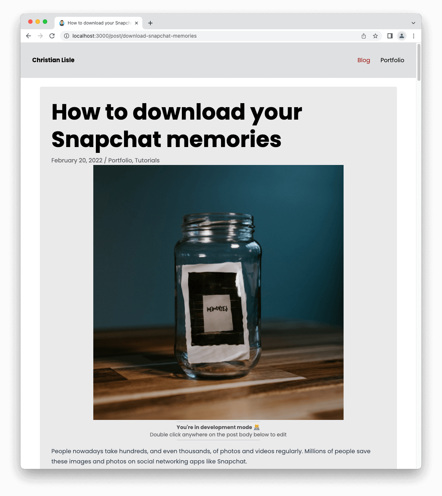

# Portfolio

Website for blogging and showcasing work. \
Built primarily with [NuxtJS](https://nuxtjs.org/) and [TailwindCSS](https://tailwindcss.com/).

<details>

<summary>Click here to see an example (<a href="http://www.cal-overflow.dev">cal-overflow.dev</a>)</summary>

View the source code for the website [here](https://github.com/cal-overflow/site)
#### Light mode
[](http://www.cal-overflow.dev)

#### Dark mode
[](http://www.cal-overflow.dev)

</details>

<!-- Table of contents -->
### Table of contents
- [Make the site your own](#make-the-site-your-own-)
  1. [Set environment variables](#1-set-environment-variables)
  2. [Enter a site description](#2-enter-a-site-description)
  3. [Create essential content](#3-create-essential-content)
  5. [Change the color palette](#4-change-the-color-palette)
  6. [Write your first blog post](#5-write-your-first-blog-post)
- [Sections](#sections)
- [Blog posts](#blog-posts-)
- [Editing content in development mode](#editing-content-in-development-mode-)
- [Running locally](#running-locally) 
  - [Environment setup](#environment-setup)
  - [Environment variables](#environment-variables)
  - [Run or generate the website](#run-or-generate-the-website)
  - [Testing](#testing-)

## Make the site your own 👨‍💻
This portfolio has been built to be "modular" so that most of the content is seperate from the components themselves.

If you'd like a website similar to mine ([cal-overflow.dev](http://www.cal-overflow.dev)), you can do so without needing to build it from scratch. Simply [use this repository as a template](https://docs.github.com/en/repositories/creating-and-managing-repositories/creating-a-repository-from-a-template#creating-a-repository-from-a-template) and follow the steps below.

### 1. Set environment variables

Reference the [Environment variables](#environment-variables) section.

### 2. Enter a site description

Find the `head` object within the `nuxt.config.js` file. Change the value of `content` in the object named `description`.

```diff
head: {
  meta: [
    // ...
    {
      hid: 'description',
      name: 'description',
-     content: "Enter your site description here."
+     content: "YOUR SITE DESCRIPTION"
    },
  ],
}
```

### 3. Create essential content
The `src/content` folder will contain not only the content of the website, but also define the site's structure.
You can get started by copying the contents of a sample content folder [here](https://github.com/cal-overflow/example-portfolio-content).

Learn more about sections [here](#sections).

**Note:** The following sections must be properly defined in the content folder (the website will not function properly without them).
- Home (`src/content/Home`) - the index page of the website. See an example [here](https://github.com/cal-overflow/example-portfolio-content/tree/main/content/home).


#### Navigation content:
The navigation (nav-bar and footer-bar) are dynamically generated. The navigation components will load the content defined within the `src/content/navigation.yml` file. The file should look like this:

```yaml
navbar: # required
  signatureNavItem: # optional
    title: 'cal overflow'
    href: '/'
  navItems:  # required
    - title: 'Blog'
      href: '/blog'
    - title: 'Portfolio'
      href: '/portfolio'
footer: # required
  navItems: # required
    - title: 'Contact Me'
      href: '/contact'
  imageNavItems: # optional
    youtubeUrl: 'https://youtube.com/c/channel'
    githubUrl: 'https://github.com/cal-overflow/portfolio'
```


#### Replace other essential content:
Placeholders of the remaining content have been provided for simplicity. Complete the following to overwrite the placehoolders.

- [ ] Replace the existing `favicon.ico` file within the `src/static/` directory.


### 4. Change the color palette
Change the color scheme of the website by editing `color` object within the `tailwind.config.js` file in the `src/` directory. You can find a small description for some of the properties below.

```js
colors: {
  'footer': '#292929',        // Background color of footer
  'menu-light': '#E0E0E1',    // Background color of menu bar in light mode
  'menu-dark': '#1F1F1F',     // Background color of menu bar in dark mode
  'card-light': '#EAEAEB',    // Background color of each card in light mode
  'card-dark': '#262626',     // Background color of each card in dark mode
  'primary-light': '#A61E17', // Primary color in light mode (red)
  'primary-dark': '#00B4E6',  // Primary color in dark mode (light blue)
  // ...
}
```

### 5. Write your first blog post

Now that you've done all the heavy lifting, your website should have a basic home page and be ready to serve some blog posts. Reference the [Blog Posts](#blog-posts-) section below for general information on writing a blog post.

---

## Sections
Sections are defined as folders within the `src/content` folder. For instance, creating a `src/content/blog` folder will define a blog section within your website. **Each section must include an `index.md` defining metadata for the section.**

### Metadata
#### Required
1. A title for the section
1. A `primaryView` in which to render for the section's default route (i.e., `/blog/` for `src/content/blog/index.md`)
1. A `secondaryView` in which to render for the section's default route (i.e., `/blog/post-1` for `src/content/blog/post-1.md`)


#### Optional
1. A description for the section
1. A list of tags for the section. This can be an empty array if no tags are.


An example `index.md` metadata is shown below.
```yml
---
# Required
title: Blog
primaryView: post-feed # What view to show on /blog page
secondaryView: post-view # What is shown on pages like /blog/create-a-portfolio-site

# Optional
description: This is the blog section.
tags:
  - Software engineering
  - Tutorial
  - Econ
  - UI/UX
---
```

## Blog posts 📝
Blog posts are written in [Markdown](https://www.markdownguide.org/) and converted to HTML with the [Nuxt Content](https://content.nuxtjs.org/) module.

To write a blog post, create a markdown file within a section (i.e., `src/content/blog/`) directory. An [example post](http://www.cal-overflow.dev/post/download-snapchat-memories) is shown below.

```md
---
id: 2
title: How to create a really cool portfolio website
slug: create-a-portfolio-site
date: Janurary 7, 2023
img: website-layout.png
tags:
  - Software Engineering
  - Tutorial
---

As software engineers, we often create tons of really cool projects and want a place where we can show off our work.

Let's take a step-by-step look into how I made my portfolio.
<!--more-->

Steps: 
1. Clone the [template repository](https://github.com/cal-overflow/portfolio).
...
```

View the Nuxt docs on [Writing Content](https://content.nuxtjs.org/writing) for a detailed explanation on how to write blog posts.

Note that feature images should be placed in directory `src/assets/images/feature/`. Other post images should be placed in `src/static/blog-images/`. Reference the [source code for cal-overflow.dev](https://github.com/cal-overflow/site) as an example.

## Post tags
Post tags allow you to group posts within the same section together based on similarities such as topic. Post tags are defined in the sections `index.md` file.

Refer to the [sections](#sections) documentation above for more information on defining tags within a section.

### Editing content in development mode 📃

When in a development environment, you can double click on `<nuxt-content>` components to edit the files in the browser.

I have created a [custom Editor component](src/components/development/Editor.vue) that builds upon the [default nuxt/content live editor](https://content.nuxtjs.org/displaying#live-editing). You can edit most content that is rendered with `<nuxt-content>` components.

<details>

<summary>View the editor in action</summary>

| Viewing post | Editing Post |
| :-: | :-: |
|  |  |

</details>

## Running locally
### Environment setup
First, navigate to the project directory and ensure you're using the correct version of Node. Then, install the Node dependencies with [npm](https://www.npmjs.com/).
```bash
$ cd portfolio

# ensure node version is correct
$ nvm use

# install dependencies
$ npm install
```

### Environment variables
Copy the contents below into a file called `.env`  and fill in the values as needed.

```text[.env]
NUXT_ENV_SITE_URL=
NUXT_ENV_FULL_NAME=
NUXT_ENV_EMAIL_ADDRESS=
NUXT_ENV_SITE_NAME=
```
<details>
  <summary>The purpose of each environment variable</summary>


  | Variable | Description | Required |
  | ----: | ------ | :--: |
  | `SITE_URL` | Utilized by the RSS feed generator to let readers know where they can find your site. | ✅ |
  | `FULL_NAME` | Utilized throughout the site.  | ✅ |
  | `EMAIL_ADDRESS` | Utilized for contact requests. | ✅ |
  | `SITE_NAME` | Utilized by the site to change the site title. If left blank, the `FULL_NAME` value is used. |  |

  Note that each environment variable name is preceded by `NUXT_ENV_` so that it is easily accessible by the nuxt application. Refer to Nuxt's [Environment Variables documentation](https://nuxtjs.org/docs/configuration-glossary/configuration-env/#automatic-injection-of-environment-variables).
</details>

### Run or generate the website
Once you've installed the necessary Node modules and configured your environment variables, you can run the application. Run the application using the command that is most appropriate for your environment.

```bash
# serve with hot reload at localhost:3000 - ideal for development
$ npm run dev

# generate static site files
$ npm run generate

# serve the static site
$ npm run start
```


### Testing 🧪

Unit tests can be run with the [Jest](https://jestjs.io/) test runner. End-to-end tests are run with [Cypress](https://www.cypress.io/). Note that the e2e tests are not recommended for use outside of the template itself (because it depends so heavily on the `src/content` folder).

```bash
# run unit tests
$ npm run unit
``` 

### Updating your website with new features in the template

If you want to bring new changes from the template repository into your website, utilize mutliple remote repositories with Git.

```bash
git remote add template git@github.com:cal-overflow/portfolio.git
# OR
git remote add template https://github.com/cal-overflow/portfolio.git

git fetch --all
git merge template/master
```
